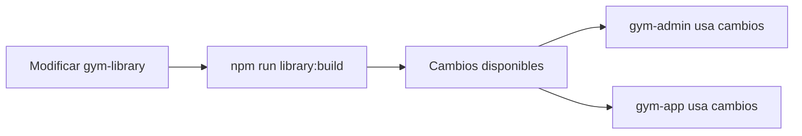

# 📚 Gym Library - Librería Compartida

> Código reutilizable entre gym-admin y gym-app

## 🎯 Propósito

**gym-library** es una librería Angular que contiene todo el código compartido entre las aplicaciones del workspace. Esto promueve la reutilización, consistencia y facilita el mantenimiento.

## 📦 ¿Qué Contiene?

### ✅ Lo que SÍ está en gym-library

#### 1. Modelos e Interfaces TypeScript

```typescript
// Modelos de dominio
export interface User {
  id: string;
  email: string;
  role: UserRole;
  name: string;
  // ...
}

export interface Routine {
  id: string;
  name: string;
  exercises: Exercise[];
  // ...
}

export interface Exercise {
  id: string;
  name: string;
  description: string;
  // ...
}

// Tipos y enums
export enum UserRole {
  ADMIN = 'admin',
  TRAINER = 'trainer',
  CLIENT = 'client',
  GYM = 'gym'
}

// Interfaces de configuración
export interface Environment {
  production: boolean;
  firebase: FirebaseConfig;
}
```

#### 2. Servicios Compartidos

```typescript
// AuthService - Autenticación
// UserService - Gestión de usuarios
// RoutineService - Gestión de rutinas
// ExerciseService - Gestión de ejercicios
// FirebaseService - Interacción con Firebase
// StorageService - Almacenamiento local
```

#### 3. Componentes UI Reutilizables

```typescript
// Ejemplo de componentes que PODRÍAN estar en la librería
// (actualmente cada app tiene sus propios componentes)

- LoadingSpinner
- ErrorMessage
- ConfirmDialog
- UserCard
- RoutineCard
```

#### 4. Guards y Pipes

```typescript
// Guards
- AuthGuard
- RoleGuard
- AdminGuard

// Pipes
- DateFormatPipe
- DurationPipe
- SafeHtmlPipe
```

#### 5. Utilidades y Helpers

```typescript
// utils/validators.ts
export function isValidEmail(email: string): boolean;
export function isStrongPassword(password: string): boolean;

// utils/formatters.ts
export function formatDate(date: Date): string;
export function formatDuration(seconds: number): string;

// utils/constants.ts
export const DATE_FORMAT = 'dd/MM/yyyy';
export const MAX_FILE_SIZE = 5 * 1024 * 1024; // 5MB
```

### ❌ Lo que NO está en gym-library

- **Variables de entorno** (credenciales, API keys)
- **Rutas y configuración de navegación**
- **Páginas completas**
- **Lógica de negocio específica de cada app**
- **Assets (imágenes, iconos)**

## 🏗️ Estructura del Proyecto

```
gym-library/
├── src/
│   ├── lib/
│   │   ├── models/           → Interfaces y tipos
│   │   │   ├── user.model.ts
│   │   │   ├── routine.model.ts
│   │   │   ├── exercise.model.ts
│   │   │   └── environment.model.ts
│   │   ├── services/         → Servicios compartidos
│   │   │   ├── auth.service.ts
│   │   │   ├── user.service.ts
│   │   │   ├── routine.service.ts
│   │   │   └── firebase.service.ts
│   │   ├── guards/           → Guards de rutas
│   │   │   ├── auth.guard.ts
│   │   │   └── role.guard.ts
│   │   ├── pipes/            → Pipes personalizados
│   │   │   └── date-format.pipe.ts
│   │   ├── utils/            → Utilidades
│   │   │   ├── validators.ts
│   │   │   └── formatters.ts
│   │   └── components/       → Componentes (futuro)
│   └── public-api.ts         → Exports públicos
├── ng-package.json           → Configuración ng-packagr
├── package.json
├── tsconfig.lib.json
└── tsconfig.spec.json
```

## 📤 Exports (public-api.ts)

```typescript
// src/public-api.ts

// Modelos
export * from './lib/models/user.model';
export * from './lib/models/routine.model';
export * from './lib/models/exercise.model';
export * from './lib/models/environment.model';

// Servicios
export * from './lib/services/auth.service';
export * from './lib/services/user.service';
export * from './lib/services/routine.service';
export * from './lib/services/firebase.service';

// Guards
export * from './lib/guards/auth.guard';
export * from './lib/guards/role.guard';

// Pipes
export * from './lib/pipes/date-format.pipe';

// Utils
export * from './lib/utils/validators';
export * from './lib/utils/formatters';
```

## 🔧 Desarrollo

### Compilar la Librería

```bash
# Build único
npm run library:build
# Output: dist/gym-library/

# Watch mode (recompila automáticamente)
npm run library:watch
```

**⚠️ Importante:** La librería DEBE compilarse antes de usarse en gym-admin o gym-app.

### Testing

```bash
npm run library:test

# Con coverage
npm run library:test -- --code-coverage
```

## 📥 Uso en las Apps

### Instalación (Automática)

Cuando ejecutas `npm run install:all`, la librería se enlaza automáticamente.

### Importar en gym-admin o gym-app

```typescript
// ✅ CORRECTO: Importar desde gym-library
import { User, UserRole, AuthService } from 'gym-library';

@Component({
  // ...
})
export class MyComponent {
  private authService = inject(AuthService);
  
  user: User | null = null;
  
  ngOnInit() {
    this.authService.getCurrentUser().subscribe(user => {
      this.user = user;
    });
  }
}
```

```typescript
// ❌ INCORRECTO: Path relativo
import { User } from '../../../shared/models/user';
```

## 🔄 Flujo de Actualización



### Workflow

1. **Hacer cambios** en gym-library
2. **Compilar** con `npm run library:build` o `npm run library:watch`
3. **Usar** en gym-admin o gym-app
4. **Testear** los cambios

## ⚙️ Configuración

### ng-package.json

```json
{
  "$schema": "node_modules/ng-packagr/ng-package.schema.json",
  "dest": "../../dist/gym-library",
  "lib": {
    "entryFile": "src/public-api.ts"
  }
}
```

### tsconfig.lib.json

```json
{
  "extends": "../../tsconfig.json",
  "compilerOptions": {
    "outDir": "../../out-tsc/lib",
    "declaration": true,
    "declarationMap": true,
    "inlineSources": true,
    "types": []
  },
  "exclude": [
    "src/**/*.spec.ts"
  ]
}
```

## 🎯 Mejores Prácticas

### 1. Mantener la Librería Genérica

```typescript
// ✅ CORRECTO: Genérico y reutilizable
export function formatCurrency(amount: number): string {
  return new Intl.NumberFormat('es-ES', { 
    style: 'currency', 
    currency: 'EUR' 
  }).format(amount);
}

// ❌ INCORRECTO: Específico de una app
export function formatGymAdminTitle(title: string): string {
  return `[Gym Admin] ${title}`;
}
```

### 2. Documentar Exports

```typescript
/**
 * Valida si un email tiene formato válido
 * @param email - Email a validar
 * @returns true si es válido, false si no
 * @example
 * isValidEmail('test@example.com') // true
 * isValidEmail('invalid-email') // false
 */
export function isValidEmail(email: string): boolean {
  const regex = /^[^\s@]+@[^\s@]+\.[^\s@]+$/;
  return regex.test(email);
}
```

### 3. Versionar Cambios Breaking

Si haces un cambio que rompe compatibilidad:

1. Documentarlo en CHANGELOG
2. Actualizar gym-admin y gym-app
3. Comunicar al equipo

### 4. Evitar Dependencias Pesadas

```typescript
// ✅ CORRECTO: Solo lo necesario
import { Injectable } from '@angular/core';
import { Observable } from 'rxjs';

// ❌ INCORRECTO: Importar todo
import * as _ from 'lodash';
import * as moment from 'moment';
```

## 📊 Beneficios de la Librería

| Beneficio | Descripción |
|-----------|-------------|
| **DRY** | No repetir código entre apps |
| **Consistencia** | Mismo comportamiento en todas partes |
| **Mantenibilidad** | Cambios en un solo lugar |
| **Testing** | Tests unitarios centralizados |
| **Type Safety** | TypeScript en toda la codebase |
| **Versionado** | Control de versiones independiente |

## 🔮 Roadmap

### Próximas Funcionalidades

- [ ] Componentes UI compartidos
- [ ] Interceptores HTTP comunes
- [ ] Sistema de caché
- [ ] Validadores de formularios
- [ ] Directivas personalizadas
- [ ] Tokens de inyección
- [ ] Sistema de logging

### Mejoras Futuras

- [ ] Publicar en npm privado
- [ ] Documentación con Storybook
- [ ] Cobertura de tests > 80%
- [ ] CI/CD automatizado

## 🧪 Testing

### Estructura de Tests

```typescript
// user.service.spec.ts
describe('UserService', () => {
  let service: UserService;
  let httpMock: HttpTestingController;

  beforeEach(() => {
    TestBed.configureTestingModule({
      imports: [HttpClientTestingModule],
      providers: [UserService]
    });
    
    service = TestBed.inject(UserService);
    httpMock = TestBed.inject(HttpTestingController);
  });

  it('should get user by id', () => {
    const mockUser: User = { id: '1', email: 'test@test.com' };
    
    service.getUser('1').subscribe(user => {
      expect(user).toEqual(mockUser);
    });
    
    const req = httpMock.expectOne('/api/users/1');
    expect(req.request.method).toBe('GET');
    req.flush(mockUser);
  });
});
```

## 📚 Recursos

- [Angular Library Guide](https://angular.dev/tools/libraries)
- [ng-packagr](https://github.com/ng-packagr/ng-packagr)
- [TypeScript Handbook](https://www.typescriptlang.org/docs/handbook/intro.html)

---

**Ver también:**
- [Arquitectura General](./overview.md)
- [Gym Admin](./gym-admin.md)
- [Gym App](./gym-app.md)
- [Guía de Desarrollo](../guides/development.md)
